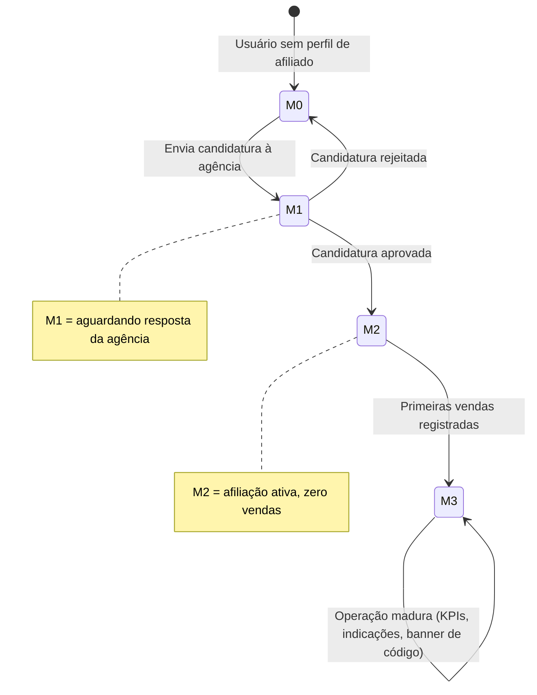

# Módulo Afiliados e Vendedores

## Visão de produto

O afiliado é uma pessoa física que se vincula a operadoras de turismo, mantém um código próprio de indicação e recebe comissão sobre as vendas originadas por ele. O Painel de Afiliados é a área logada onde o afiliado acompanha indicações, ganhos, produtos permitidos e configurações. A entrada de novos afiliados acontece pela Sala de Negócios (ver [[sala-de-negocios]]).

- **FATO** (Bloco 3): Vendedores e Afiliados são módulos separados, mas compartilham lógica de listagem, cadastro, performance e comissões.
- **DECISÃO** (PRD / reuniões): na V1 o modelo de entrada é o afiliado se candidatando à agência, e não a agência convidando o afiliado. Todo copy e fluxo deve refletir essa inversão.
- **FATO** (08/07, Cristiano): a pessoa vira usuária do sistema antes de virar afiliada; existe um estado "sem perfil de afiliado". A comissão desejada é informada no próprio cadastro do perfil.

## Status das entregas (fonte: Plano de Ação 13/07 a 31/08)

| Status | Plataforma | Entrega |
| --- | --- | --- |
| ✅ Entregue | Web | Home de início com código, atalhos, KPIs e indicações recentes |
| ✅ Entregue | Web | Área de indicações com KPIs e listagem geral |
| ✅ Entregue | Web | Área de ganhos com KPIs, comissões por organização e extratos |
| ✅ Entregue | Web | Área de produtos e links permitidos para venda e solicitações de filiação |
| ✅ Entregue | Web | Configurações: perfil, recebimento, organizações, senha e notificações |
| ✅ Entregue | Web | Ajuda e suporte com FAQ e contato com a Retrilhar |
| 🟧 Em andamento | Web | Refinamentos finais de UI e consistência entre páginas (conclusão funcional 17/07) |
| 🟧 Em andamento | Web | Conectar navegação, estados essenciais e protótipo para handoff (congelar até 17/07) |

**Gate 0 (17/07)**: Painel de Afiliados e Sala de Negócios organizados, prototipados e sem decisão estrutural aberta.

## Ciclo de vida do afiliado no painel

**DECISÃO** (protótipo Home v3, validado como modelo de estados): o painel adapta a home ao estágio do afiliado.

- **PROPOSTA** (protótipo): após a aprovação da agência, o afiliado confirma as condições antes de a afiliação nascer (aprovação tratada como proposta). **PENDENTE**: validar com Cristiano se a aprovação cria vínculo direto ou exige essa confirmação.
- **PENDENTE**: regras após candidatura rejeitada (recandidatura permitida? prazo?) não estão definidas.

## Regras de negócio consolidadas

- **DECISÃO**: formas de recebimento seguem estrutura um-para-muitos ("Formas de recebimento"): um afiliado pode ter múltiplas formas cadastradas.
- **DECISÃO**: a listagem de indicações é ancorada no pedido/carrinho, com colunas confirmadas: comprador, organização, pedido, atividade, valor e comissão.
- **FATO** (Bloco 3): o mesmo afiliado pode atuar para múltiplas empresas com o mesmo código; ganhos e produtos precisam de contexto por organização.
- **DECISÃO** (08/07): aceite ou recusa de oportunidades sem contraproposta na V1; negociação de condições é visão futura.
- **DECISÃO** de nomenclatura: usar "afiliação" na interface; não introduzir "contrato" ou "vínculo" sem decisão específica.

## Pendências abertas

- **PENDENTE (alta, HP16)**: a candidatura é à agência como um todo ou a produtos específicos? Dono: Cristiano.
- **PENDENTE**: fluxo de confirmação pós-aprovação (ver diagrama acima). Dono: Cristiano.
- **PENDENTE**: os quatro valores de status "condicionante" estão com Matheus (backend do módulo).
- **PENDENTE**: impacto em cascata do modelo de candidatura sobre copy da landing, onboarding e boards da Sala de Negócios.
- **ATENÇÃO**: qualquer reabertura de escopo após o congelamento de 17/07 entra como correção bloqueadora ou vai para o backlog (regra de proteção do plano).

## Vendedores

- **FATO** (Bloco 3): tarefas identificadas: Lista e Novo, Detalhes.
- **PENDENTE**: Vendedores não aparece no plano de ação de julho/agosto; fica fora do ciclo atual salvo decisão nova.
