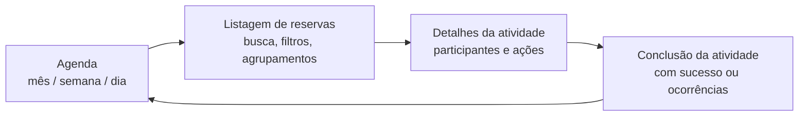
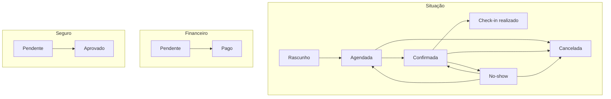

# Módulo Agenda / Operação

## Visão de produto

A Agenda é o centro de planejamento temporal da operação: sem atividade cadastrada não existe reserva, mapa de vagas nem listas. Ela atende dois perfis descritos no RNPN 002: o Gestor Operacional (planeja, controla vagas, gerencia recursos e equipe, tem visão completa) e o Líder de Operação / guia (executa a atividade no dia, faz check-in e conduz o roteiro). O detalhamento da execução em campo está em [[detalhes-atividade]].

- **FATO** (Bloco 1): visualizações de calendário por mês, semana, dia e lista, com menção a visualização por produto.
- **FATO** (testes de usabilidade): a visualização de vagas foi considerada clara e a agenda visualmente confortável para localizar atividades.

## Status das entregas (fonte: Plano de Ação 13/07 a 31/08)

| Status Web | Status Mobile | Entrega                                                             | Prazo                              |
| ---------- | ------------- | ------------------------------------------------------------------- | ---------------------------------- |
| ✅         | ✅            | Visualizações por mês, semana e atividades do dia                   | Entregue                           |
| ☐          | ☐             | Refatoração da página inicial da Agenda                             | Web 20 a 24/07 · Mobile 03 a 07/08 |
| ☐          | ☐             | Área de listagem de reservas                                        | Web 20 a 31/07 · Mobile 03 a 07/08 |
| ☐          | ☐             | Fluxo de conclusão das atividades do dia                            | Web 27 a 31/07 · Mobile 10 a 14/08 |
| ☐          | ☐             | Busca, filtros, ordenação e agrupamentos da listagem                | junto da listagem de reservas      |
| ☐          | ☐             | Estados vazio, carregamento, erro, atraso, conflito e sem permissão | obrigatórios antes de cada gate    |
| ☐          | ☐             | Protótipo integrado: Agenda, Reservas, Detalhes, Conclusão          | Gate desktop 31/07 · mobile 14/08  |

**Gate 1 (31/07)**: Agenda desktop completa, com página inicial, reservas e conclusão integradas em jornada navegável.
**Gate 2 (14/08)**: mesma jornada adaptada ao mobile, sem perda de contexto.

## Jornada operacional

## Reservas: modelo de estados

**DECISÃO** (conversas de maio/junho, implementado no protótipo): cada reserva carrega três trilhas de estado independentes que se influenciam por gatilhos definidos, mas evoluem em paralelo:

- **DECISÃO**: no-show é operacionalmente neutro e reversível; não gera consequência financeira automática e permite voltar para Confirmada, Cancelada ou Agendada.
- **DECISÃO** (17/06): "remarcada" não é status formal; é um indicador visual discreto que coexiste com os estados da trilha Situação.

## Pendências abertas

- **PENDENTE** (17/06): totalizador de tarifas no painel do dia; busca global de participante; remarcação para outra atividade (novo componente de seleção); reservas por período para cenários de múltiplos dias (camping/hospedagem); tratamento de opcionais e tarifas na remarcação.
- **PENDENTE** (24/06): rebooking de hospedagem com seleção de período, inconsistência de disponibilidade e aviso de overbooking; recorrência antes dos horários no fluxo de nova atividade; cadastro múltiplo de eventos; histórico de alterações de evento.
- **PENDENTE**: comportamento mobile do calendário mensal com alta densidade de eventos.
- **ATENÇÃO**: revisar ações permitidas por status da reserva e por perfil de acesso antes dos gates (item transversal do plano).
