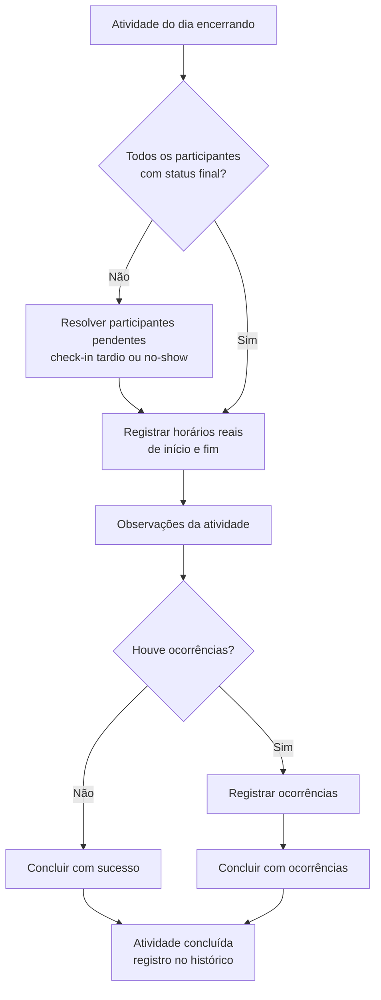

# Detalhes da Atividade

## Visão de produto

Página de execução de uma atividade específica: lista de participantes com ações individuais e em massa, check-in (inclusive por QR Code), resumo de ocupação e alertas, equipe responsável, histórico e a conclusão da atividade ao final do dia. É a etapa central da jornada em campo do Líder de Operação. Contexto geral em [[agenda]].

## Status das entregas (fonte: Plano de Ação 13/07 a 31/08)

| Status Web | Status Mobile | Entrega |
| --- | --- | --- |
| ✅ | 🟧 | Listagem completa das reservas, ações individuais e detalhes do participante (interação mobile em 10 a 14/08) |
| ✅ | ☐ | Multiselect / bulk actions para ações operacionais em massa |
| ✅ | ✅ | Check-in via QR Code e cenários alternativos |
| ✅ | ✅ | Resumo da atividade: ocupação, alertas, opcionais, previsão e atalho de QR Code |
| ✅ | ✅ | Equipe responsável e cenários de conflito, seguro, remoção e WhatsApp |
| ✅ | ✅ | Histórico da atividade e mensagens de observação |
| ✅ | ☐ | Fluxo de conclusão da atividade com sucesso e com ocorrências |
| ✅ | ☐ | Fluxo "Mais ações": editar, comunicar, atribuir equipe, listas, manifestos e cancelar |
| ✅ | ✅ | Responsividade da área principal, resumo, equipe e histórico em bottom sheet |
| — | ☐ | Ações do three dot menu no mobile (10 a 14/08) |
| — | ☐ | Comportamento de bulk actions no mobile (10 a 14/08) |
| — | ☐ | Ações da função "Mais ações" no mobile (10 a 14/08) |
| — | ☐ | Conclusão da atividade em tela cheia no mobile (10 a 14/08) |

## Diretriz mobile (DECISÃO, plano de ação)

- Three dot menu e "Mais ações" usam bottom sheets contextuais.
- Bulk actions usa modo de seleção com barra fixa.
- A conclusão da atividade acontece em fluxo de tela cheia.

## Fluxo de conclusão da atividade

- **FATO** (plano de ação): a conclusão em tela cheia no mobile inclui participantes sem status final, no-show, horários reais, observações e ocorrências.
- **DECISÃO** (herdada de [[agenda]]): no-show é reversível e sem consequência financeira automática.

## Pendências abertas

- **PENDENTE**: todo o pacote mobile de 10 a 14/08 listado acima (Gate 2 em 14/08).
- **ATENÇÃO**: validar ações por status da reserva e por perfil de acesso antes do Gate 2.
