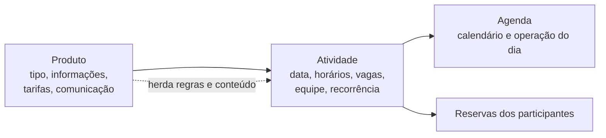

# Módulo Catálogo de Produtos

## Visão de produto

O produto é a base de tudo: define o que a operadora vende, alimenta a criação de atividades na Agenda e sustenta a comunicação com o cliente (pré-evento, voucher e pós-evento). O bloco de CRUDs e Home é a última prioridade funcional do ciclo atual e só começa após o gate da jornada operacional mobile.

- **FATO** (Bloco 4): o escopo cobre Lista de Produtos e Cadastro/Edição de Produto.
- **DECISÃO** (24/06): o fluxo de cadastro começa definindo o tipo de produto antes dos detalhes da atividade.

## Status das entregas (fonte: Plano de Ação 13/07 a 31/08)

| Status Web | Status Mobile | Entrega                                                       | Prazo                     |
| ---------- | ------------- | ------------------------------------------------------------- | ------------------------- |
| ✅         | —             | Área de CRUD de produtos web                                  | Entregue                  |
| 🟧         | —             | Fluxo de cadastro de produtos web                             | retomar 17 a 21/08        |
| 🟧         | —             | Fluxo de criação de atividade web                             | retomar 17 a 21/08        |
| ☐          | —             | Validar herança e integração Produto, Atividade e Agenda      | Gate 21/08                |
| ☐          | ☐             | Consolidar inventário dos CRUDs remanescentes e ordem interna | lista congelada até 14/08 |
| ☐          | ☐             | Executar CRUDs remanescentes priorizados                      | 17 a 28/08                |
| ☐          | ☐             | Home / Dashboard principal do painel administrativo           | 24 a 28/08                |
| ☐          | ☐             | Estados, responsividade e consistência dos CRUDs e Home       | antes do Gate 3 (28/08)   |

**Gate 3 (28/08)**: CRUDs e Home do recorte congelado concluídos, com estados e responsividade definidos.

## Herança Produto, Atividade, Agenda

- **PENDENTE**: mapear exatamente quais campos e regras a atividade herda do produto e quais podem ser sobrescritos por evento. É o objeto do gate de 21/08.
- **PENDENTE** (24/06): histórico de alterações de produto e de evento após salvar.

## Regras de proteção (DECISÃO, plano de ação)

- A lista de CRUDs precisa estar fechada até 14/08. Novos CRUDs ou ampliações de Home depois dessa data entram no backlog pós-agosto, salvo substituição explícita de item já planejado.

## Pendências abertas

- **PENDENTE**: extrair a matriz completa de requisitos do Bloco 4.
- **PENDENTE**: validar regras de comunicação pré-evento, voucher e pós-evento contra fonte canônica antes de consolidar.
- **PENDENTE**: definir o inventário e a ordem interna dos CRUDs remanescentes (prazo 14/08).
