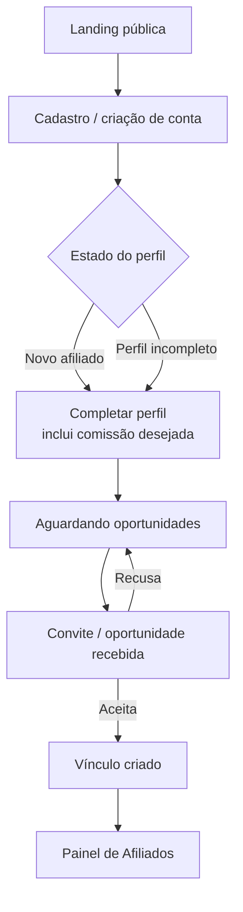

# Sala de Negócios

## Visão de produto

A Sala de Negócios é o site externo, separado do painel administrativo, onde a pessoa conhece o programa, cria conta, monta o perfil de afiliado e recebe oportunidades até formar o vínculo com uma operadora. É a porta de entrada do ciclo de vida descrito em [[afiliados-vendedores]].

- **DECISÃO**: a Sala de Negócios é um site próprio, fora do painel admin.
- **DECISÃO** (plano de ação): o recorte deste ciclo é o MVP desktop, sem expansão para gestão B2B completa.

## Status das entregas (fonte: Plano de Ação 13/07 a 31/08)

| Status          | Entrega                                                                                           | Prazo                 |
| --------------- | ------------------------------------------------------------------------------------------------- | --------------------- |
| 🟧 Em andamento | Landing page da Sala de Negócios                                                                  | 13/07                 |
| 🟧 Em andamento | Formulário de cadastro / criação de conta como afiliado                                           | 13/07                 |
| 🟧 Em andamento | Home inicial da Sala de Negócios do afiliado                                                      | 13/07                 |
| ☐ Pendente      | Estados essenciais: novo afiliado, perfil incompleto, aguardando oportunidades, convite e vínculo | validar em 13 a 14/07 |
| ☐ Pendente      | Conectar CTAs entre cadastro, Sala de Negócios e Painel de Afiliados                              | até 14/07             |
| ☐ Pendente      | Organização do protótipo, anotações e handoff                                                     | congelar até 17/07    |

## Fluxo principal (jornada do afiliado)

- **FATO** (plano de ação): os cinco estados essenciais do MVP são novo afiliado, perfil incompleto, aguardando oportunidades, convite e vínculo.
- **DECISÃO** (08/07): aceite ou recusa, sem contraproposta na V1.

## Limite de escopo (DECISÃO, plano de ação)

Fora deste ciclo: negociação comercial completa, contratos B2B, marketplace entre organizações, comissões avançadas entre empresas e gestão administrativa completa do pool. Tudo isso é evolução posterior.

## Pendências e riscos

- **ATENÇÃO (conflito aberto)**: o PRD (Katiely) indica que a operadora navega o pool e convida; a fala de 08/07 aponta a sala apenas na visão do afiliado. Onde mora a visão da operadora (site dedicado logado ou painel admin) segue sem decisão. Registrar resolução como DEC quando fechar.
- **PENDENTE**: copy da landing e do onboarding precisa ser auditada contra o modelo de candidatura (afiliado se candidata, agência não convida) antes do congelamento.
- **ATENÇÃO** (risco do plano): expansão de escopo da Sala é risco mapeado; manter MVP e separar evoluções.
