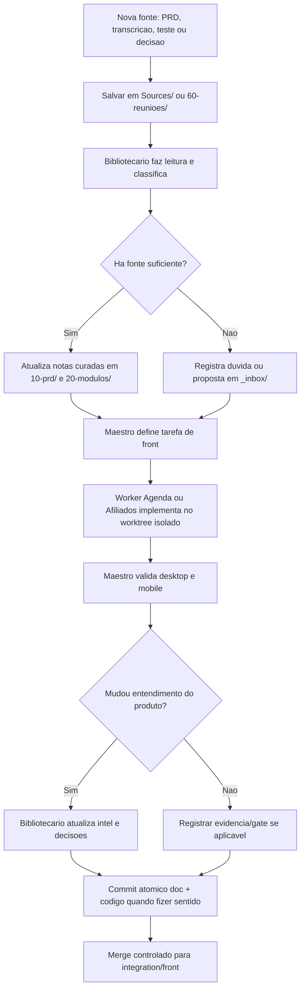
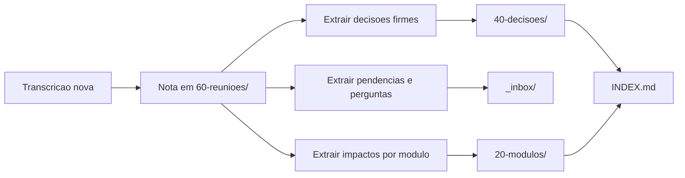

# Fluxo de documentacao viva com Maestri

## Objetivo

Manter documentacao, planejamento e codigo sincronizados sem depender de memoria de chat. O vault Obsidian e a fonte navegavel; Git e a trilha de versao; Maestri coordena agentes e portais.

## Fluxo principal

## Responsabilidades

| Papel | Responsabilidade | Write set |
| --- | --- | --- |
| Maestro | Orquestracao, gates, conflitos, merges e decisao de escopo. | Qualquer area quando necessario, com cuidado de worktree. |
| Bibliotecario | Curadoria, ingestao de fontes, decisoes, mapas de modulo e pendencias. | `Retrilhar Intel/**` |
| Agenda Worker | Melhorias da agenda/admin. | Worktree `work/agenda-front`, escopo Agenda. |
| Afiliados Worker | Melhorias de afiliados. | Worktree `work/afiliados-front`, escopo Afiliados. |

## Gate de atualizacao da intel

Uma nota curada so deve ser alterada quando houver:

- fonte local;
- decisao do usuario;
- evidencia de codigo validada;
- ou registro explicito como `INFERENCIA`, `PROPOSTA` ou `PENDENTE`.

## Fluxograma de ingestao de reuniao

## Regras contra drift

- Se o codigo implementado divergir da nota do modulo, abrir pendencia antes de seguir.
- Se uma transcricao contradisser PRD anterior, criar nota em `_inbox/` com as duas fontes.
- Se o modulo ainda nao existir no worktree limpo, nao documentar como implementado.
