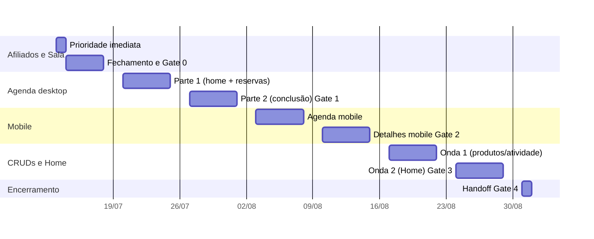

# Plano de Ação 13/07 a 31/08/2026

Síntese curada do documento "Plano de Ação e Checklist de Entregas - Retrilhar". O status detalhado por tarefa vive na nota de cada módulo; esta nota guarda prioridades, cronograma, gates e riscos.

**FATO**: o docx original está versionado em `Sources/Plano_de_Acao_2026-07-13_a_08-31.docx`, e o catálogo de fontes aponta para esse arquivo como trilha bruta de auditoria.

## Ordem de prioridade

| Ordem | Bloco | Janela | Resultado esperado |
| --- | --- | --- | --- |
| 1 | Painel de Afiliados + Sala de Negócios | 13 a 17/07 | Concluir, validar, organizar e congelar o escopo |
| 2 | Agenda desktop | 13 a 31/07 | Fechar página inicial, reservas e conclusão das atividades do dia |
| 3 | Agenda + Detalhes da Atividade mobile | 03 a 14/08 | Completar a jornada operacional para uso em campo |
| 4 | CRUDs + Home | 17 a 28/08 | Finalizar fluxos iniciados, CRUDs remanescentes e Home principal |
| 5 | Validação final e handoff | 31/08 | Corrigir bloqueadores, documentar e consolidar backlog posterior |

Premissa de nomenclatura: "Home" no plano refere-se à Home/Dashboard principal do painel administrativo.

## Cronograma executivo e gates

| Gate | Data | Critério |
| --- | --- | --- |
| Gate 0 | 17/07 | Afiliados e Sala de Negócios organizados, prototipados e sem decisão estrutural aberta |
| Gate 1 | 31/07 | Agenda desktop completa: página inicial, reservas e conclusão integradas |
| Gate 2 | 14/08 | Agenda e Detalhes da Atividade mobile completos para a jornada em campo |
| Gate 3 | 28/08 | CRUDs e Home do recorte congelado concluídos, com estados e responsividade |
| Gate 4 | 31/08 | Sem pendência bloqueadora, Figma organizado, regras anotadas e backlog separado |

Critério geral de "entregue": navegável, coerente com as regras e pronto para desenvolvimento.

## Qualidade e documentação (transversal)

- Validar desktop antes do mobile em cada jornada.
- Revisar estados default, vazio, loading, erro, bloqueado e sem permissão antes de cada gate.
- Validar ações por status da reserva e por perfil de acesso (Agenda e Detalhes).
- Revisar responsividade em mobile estreito, mobile padrão, tablet e desktop até 28/08.
- Organizar protótipos, componentes, anotações e regras no Figma; consolidação em 31/08.
- Separar correções bloqueadoras de melhorias pós-agosto; revisão final e handoff em 31/08.

## Riscos e regras de proteção

| Risco | Impacto | Proteção |
| --- | --- | --- |
| Aprovação tardia | Feedback acima de 24h desloca o gate seguinte | Aprovação objetiva por jornada, decisões registradas |
| Reabertura de entregas | Frentes aprovadas voltam à exploração | Só correções bloqueadoras; melhorias viram backlog |
| Expansão da Sala de Negócios | Entrada de B2B, contratos, marketplace | Manter MVP e separar evoluções |
| CRUDs sem inventário fechado | Telas crescem na última quinzena | Congelar lista e ordem até 14/08 |
| Mobile acumulado | Adaptação no fim gera retrabalho | Mobile imediatamente após o gate desktop |

## Como manter este plano vivo

1. Ao concluir uma tarefa, o Bibliotecário atualiza o status (☐ para 🟧 para ✅) na nota do módulo correspondente, citando a evidência (commit, preview validado ou reunião).
2. Ao passar um gate, registrar a data real e eventuais ressalvas aqui.
3. Mudanças de escopo entram primeiro em `_inbox/` e só depois nas notas de módulo.
